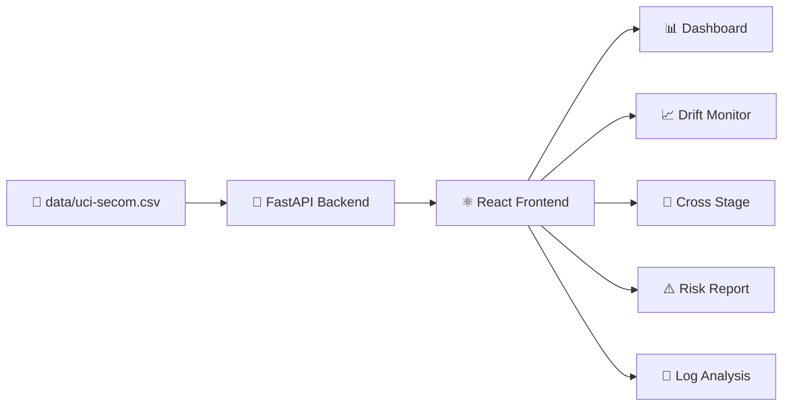

# 🛡️ FalsePass Hunter

> 🚀 **基于 Kaggle UCI SECOM 数据集的智能制造质量分析平台**

<div align="center">

[](LICENSE)
[](https://react.dev/)
[](https://fastapi.tiangolo.com/)
[](https://www.python.org/)
[](https://www.kaggle.com/datasets)
[](https://github.com/Illusion-Breakers/FalsePass-Hunter)

[📖 文档](#-文档) • [🚀 快速开始](#-快速开始) • [📊 功能特性](#-功能特性) • [🏗️ 项目架构](#️-项目架构) • [👥 团队](#-团队)

</div>

---

## 📖 目录

<details>
<summary>点击展开完整目录</summary>

- [✨ 功能特性](#-功能特性)
- [🎯 页面总览](#-页面总览)
- [🏗️ 项目架构](#️-项目架构)
- [📂 项目结构](#-项目结构)
- [🚀 快速开始](#-快速开始)
- [🔌 API 文档](#-api-文档)
- [📊 数据说明](#-数据说明)
- [🧪 测试与验证](#-测试与验证)
- [🛠️ 技术栈](#️-技术栈)
- [🤝 贡献指南](#-贡献指南)
- [📄 许可证](#-许可证)
- [👥 团队](#-团队)
- [📬 联系我们](#-联系我们)

</details>

---

## ✨ 功能特性

<div align="center">

| 🎯 | 📈 | 🔍 |
|:---:|:---:|:---:|
| **真实数据驱动** | **可视化分析** | **可解释性** |
| 基于 Kaggle UCI SECOM 真实制造数据 | 多维度图表展示风险趋势 | Evidence Chain 证据链追踪 |

| 🔔 | 📄 | 🌐 |
|:---:|:---:|:---:|
| **实时告警** | **报告导出** | **跨平台** |
| 漂移监控与异常检测 | PDF 格式风险报告导出 | React + FastAPI 全栈架构 |

</div>

---

## 🎯 页面总览

```
┌─────────────────────────────────────────────────────────────────┐
│                        FalsePass Hunter                         │
├─────────────┬─────────────┬─────────────┬─────────────┬─────────┤
│  📊 Home    │  📈 Drift   │  🔀 Cross   │  ⚠️ Risk   │  📝 Log │
│  主驾驶舱   │  漂移监控   │  跨工序分析 │  风险报告   │  日志分析│
└─────────────┴─────────────┴─────────────┴─────────────┴─────────┘
```

| 页面 | 图标 | 作用 | 核心 API | 输出内容 |
|:---|:---:|:---|:---|:---|
| **Home** | 🏠 | 项目入口和导航 | - | 快速导航 |
| **Dashboard** | 📊 | 主驾驶舱 | `/api/dashboard/summary` | 趋势图、站点概览、风险分布、证据链 |
| **Drift Monitor** | 📈 | 漂移监控 | `/api/drift/summary` | 时间窗口漂移对比、异常事件 |
| **Cross Stage** | 🔀 | 跨工序分析 | `/api/cross-stage/summary` | 工序间风险对比、关联分析 |
| **Risk Report** | ⚠️ | 单样本报告 | `/api/risk/report` | 风险评分、证据摘要、PDF 导出 |
| **Log Analysis** | 📝 | 日志分析 | `/api/log/analyze` | 结构化日志分析结果 |

---

## 🏗️ 项目架构



### 数据流向

```
┌──────────────┐     ┌──────────────┐     ┌──────────────┐
│   CSV 数据源   │ ──> │  FastAPI 处理  │ ──> │  React 展示层  │
│  uci-secom.csv│     │   main.py    │     │    各页面组件   │
└──────────────┘     └──────────────┘     └──────────────┘
       │                      │                      │
       ▼                      ▼                      ▼
  1567 行 × 592 列        RESTful API           可视化图表
  Time + Pass/Fail       JSON 响应             PDF 导出
```

---

## 📂 项目结构

```
FalsePass-Hunter/
├── 📄 README.md                 # 中文说明文档
├── 📄 README_EN.md              # English documentation
├── 📄 LICENSE                   # MIT License
├── 📦 data/
│   └── uci-secom.csv            # Kaggle UCI SECOM 数据集 (1567×592)
├── 🔧 backend/
│   ├── main.py                  # FastAPI 主应用
│   └── requirements.txt         # Python 依赖
└── ⚛️ src/
    ├── pages/                   # 页面组件
    │   ├── Dashboard.jsx        # 📊 主驾驶舱
    │   ├── DriftMonitor.jsx     # 📈 漂移监控
    │   ├── CrossStage.jsx       # 🔀 跨工序分析
    │   ├── RiskReport.jsx       # ⚠️ 风险报告
    │   └── LogAnalysis.jsx      # 📝 日志分析
    ├── components/              # 可复用组件
    ├── data/                    # 前端数据配置
    ├── styles/                  # 样式文件
    └── App.jsx                  # 应用入口
```

---

## 🚀 快速开始

### 前置要求

- **Node.js** >= 16.0.0
- **Python** >= 3.9
- **npm** >= 8.0.0

### 1️⃣ 克隆项目

```bash
git clone https://github.com/Illusion-Breakers/FalsePass-Hunter.git
cd FalsePass-Hunter
```

### 2️⃣ 安装后端依赖

```bash
cd backend
pip install -r requirements.txt
```

### 3️⃣ 启动后端服务

```bash
uvicorn main:app --reload --port 8000
```

> ✅ 访问 `http://localhost:8000/api/health` 验证后端状态

### 4️⃣ 安装前端依赖

```bash
cd ../src
npm install
```

### 5️⃣ 启动前端开发服务器

```bash
npm run dev
```

> 🎉 访问 `http://localhost:3000` 查看应用

---

## 🔌 API 文档

### 端点总览

| 方法 | 端点 | 描述 | 参数 |
|:---:|:---|:---|:---|
| `GET` | `/api/health` | 健康检查 | - |
| `GET` | `/api/dashboard/summary` | 驾驶舱数据 | `station`, `timeRange` |
| `GET` | `/api/drift/summary` | 漂移分析 | `station`, `timeRange` |
| `GET` | `/api/cross-stage/summary` | 跨工序分析 | - |
| `GET` | `/api/risk/report` | 风险报告 | `sampleId` |
| `POST` | `/api/log/analyze` | 日志分析 | `{ logText }` |

### 响应示例

#### Dashboard Summary

<details>
<summary>点击查看响应结构</summary>

```json
{
  "metrics": {
    "totalTested": 1567,
    "falsePass": 42,
    "riskAlerts": 15,
    "confidence": 0.94
  },
  "trendData": [...],
  "stations": [...],
  "riskDistribution": {
    "low": 850,
    "medium": 500,
    "high": 217
  },
  "provenance": "data/uci-secom.csv",
  "evidenceChain": {...}
}
```

</details>

---

## 📊 数据说明

### UCI SECOM 数据集

| 属性 | 值 |
|:---|:---|
| **来源** | Kaggle - UCI SECOM |
| **样本数** | 1,567 行 |
| **特征数** | 592 列 |
| **关键字段** | `Time`, `Pass/Fail` |
| **数据类型** | 半导体制造传感器数据 |

### 数据验证

```bash
# 验证数据完整性
cd backend
python -c "import pandas as pd; df = pd.read_csv('data/uci-secom.csv'); print(f'Rows: {len(df)}, Cols: {len(df.columns)}')"
```

---

## 🧪 测试与验证

### 后端健康检查

```bash
curl http://localhost:8000/api/health
```

### 前端构建测试

```bash
cd src
npm run build
```

---

## 🛠️ 技术栈

<div align="center">

| 层级 | 技术 | 版本 |
|:---:|:---|:---:|
| **Frontend** |    |
| **Backend** |   |
| **Data** |  |

</div>

---

## 🤝 贡献指南

我们欢迎各种形式的贡献！

1. 🍴 Fork 本仓库
2. 🌿 创建特性分支 (`git checkout -b feature/AmazingFeature`)
3. 💾 提交更改 (`git commit -m 'Add some AmazingFeature'`)
4. 🚀 推送到分支 (`git push origin feature/AmazingFeature`)
5. 📝 创建 Pull Request

---

## 📄 许可证

本项目采用 MIT 许可证 - 查看 [LICENSE](LICENSE) 文件了解详情。

---

## 👥 团队

<div align="center">

**🎨 Illusion-Breakers**

*用代码照亮数据的真相*

</div>

---

## 📬 联系我们

- 📧 **GitHub**: [Illusion-Breakers/FalsePass-Hunter](https://github.com/Illusion-Breakers/FalsePass-Hunter)
- 🐛 **Issue**: 在项目 Issues 页面提交问题
- 💬 **Discussion**: 欢迎在 Discussions 发起讨论

---

<div align="center">

**Made with ❤️ by Illusion-Breakers**

[⬆️ 返回顶部](#-falsepass-hunter)

</div>
